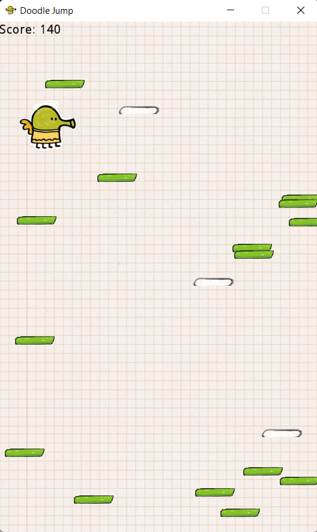
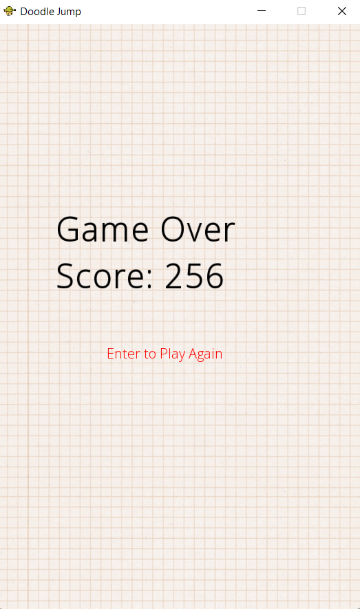

# Advanced Programming Game Project: Doodle Jump
C++ Game for my Honor Project Assignment in Advanced Programming. 

In this project, I used SFML - one of the popular game libraries in C++ . This is just a simple project,
and also my first time ever creating a C++ Game, which had taken a lot of time for me to study 😵. Therefore, there will be some minor errors due to lack of research time (or I was too lazy to fix 😴).

I have also attached the report for the code for further research. The report also gives you some insights into some Object-Oriented and Functional Programming Languages, namely Java & Ruby
for the former and Haskell vs. Standard ML for the latter. Hopefully you can learn something from my paper. 👨‍🎓

Happy coding !

# Images

## Menu (Press Enter to play)

## Main Game

## Final Score

